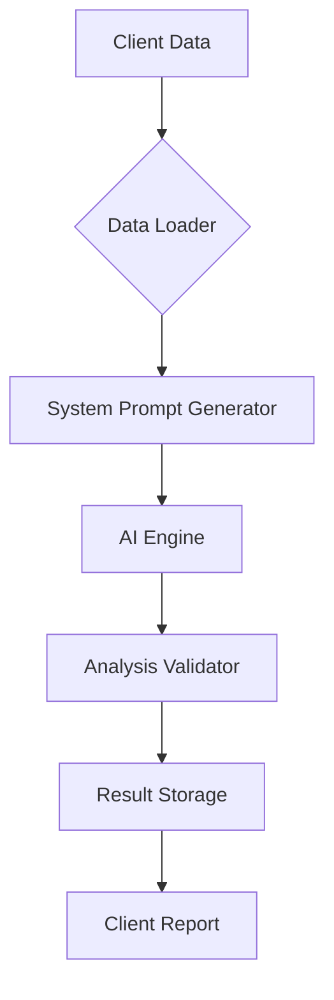

# HSBC AI-Powered Wealth Management System

## Overview

An enterprise-grade solution combining AI analytics with HSBC's financial expertise to deliver:

- Real-time client financial profiling
- Predictive wealth management recommendations
- Automated product matching engine
- Regulatory-compliant reporting
- Historical analysis tracking
- Multi-device responsive interface

## Prerequisites

- Node.js v18+ & npm v9+
- Python 3.10+
- Virtual environment (venv)

## Installation & Setup

### Environment Configuration

```bash
cd backend
cp dotenv.template .env
```

### Frontend Setup

```bash
cd frontend
npm install
npm run dev
```

### Backend Setup

1. Create virtual environment:
```bash
cd backend
python -m venv venv
```

2. Activate and install dependencies:
```bash
venv\Scripts\activate
pip install -r requirements.txt
```

3. Start development server:
```bash
python -m app.run
```

## Project Structure

```text
backend/
├── app/
│   ├── config.py           # Application configuration
│   ├── llm/
│   │   ├── gemini.py       # AI model integration
│   │   └── sysPrompt.py    # Prompt engineering templates
│   ├── router/
│   │   ├── clients.py      # Client management endpoints (CRUD)
│   │   ├── products.py     # Product catalog API
│   │   └── client_analysis.py # AI-driven analysis endpoints
│   ├── storage/
│   │   └── analysis_storage.py # Analysis result persistence
│   ├── load_data/
│   │   └── data.py         # Data loading utilities
│   └── records/
│       └── ai_analysis_db # Analysis history storage
frontend/
├── src/
│   ├── components/
│   │   ├── AppHeader.jsx    # Application header
│   │   ├── ClientInput.jsx  # Client data entry form
│   │   ├── ClientOverview.jsx # Client summary view
│   │   ├── ErrorMessage.jsx # Error handling component
│   │   ├── NavBar.jsx       # Navigation panel
│   │   └── ProductRecommendations.jsx # AI suggestions
│   ├── pages/
│   │   ├── AnalysisHistory.jsx # Historical reports
│   │   ├── ClientAnalysis.jsx # Real-time analysis
│   │   ├── ClientTable.jsx  # Client directory
│   │   └── ProductsTable.jsx # Product inventory
│   ├── styles/
│   │   ├── base.css        # Global styles
│   │   ├── components.css  # Component-specific styles
│   │   └── responsive.css  # Media queries
```
## API Reference

### Client Management
`GET /clients`
- Returns paginated list of clients with filtering options
- Query Params:
  - `page` (default: 1)
  - `limit` (default: 20)
  - `sort` (field to sort by)

### Product Catalog
`GET /products`
- Returns HSBC's investment product catalog
- Supports search by product features:
  - `risk_level`
  - `minimum_investment`
  - `product_type` (e.g., 'ETF', 'Mutual Fund')

### AI Analysis
`GET /client_analysis/{client_id}`
- Generates personalized wealth management strategy
- Path Parameters:
  - `client_id`: UUID client identifier
- Response Structure:
  ```json
  {
    "risk_profile": "Conservative/Moderate/Aggressive",
    "recommended_products": [{
      "product_id": "HSBC-ETF-123",
      "allocation_percentage": 35,
      "rationale": "Matches client's long-term goals"
    }],
    "financial_health_score": 78,
    "timestamp": "2025-08-31T05:37:10Z"
  }
  ```


## Development

1. Start backend server:
```bash
cd backend
venv\Scripts\activate
python -m app.run
```

2. In separate terminal, start frontend:
```bash
cd frontend
npm run dev
```

## Contributing
1. Create feature branch from `main`
2. Follow conventional commits format:
  - `feat: Add new client analysis endpoint`
  - `fix: Resolve pagination issue in client table`
3. Update documentation concurrently with code changes
4. Include test coverage for new features
5. Open PR with template:
  - Description of changes
  - Screenshots (for UI changes)
  - Performance metrics (for critical paths)


## AI Integration Architecture


Key Components:
1. `gemini.py`: Handles AI model integration with:
  - Rate limiting
  - Response caching
  - Fallback mechanisms
2. `sysPrompt.py`: Maintains SEC-compliant templates for:
  - Risk disclosure
  - Product suitability checks
  - Regulatory requirements

## Data Sources

Sample data files located in `backend/app/data/`:
- `client.json`: Demo client records with financial profiles
- `products.json`: HSBC product catalog with specifications
