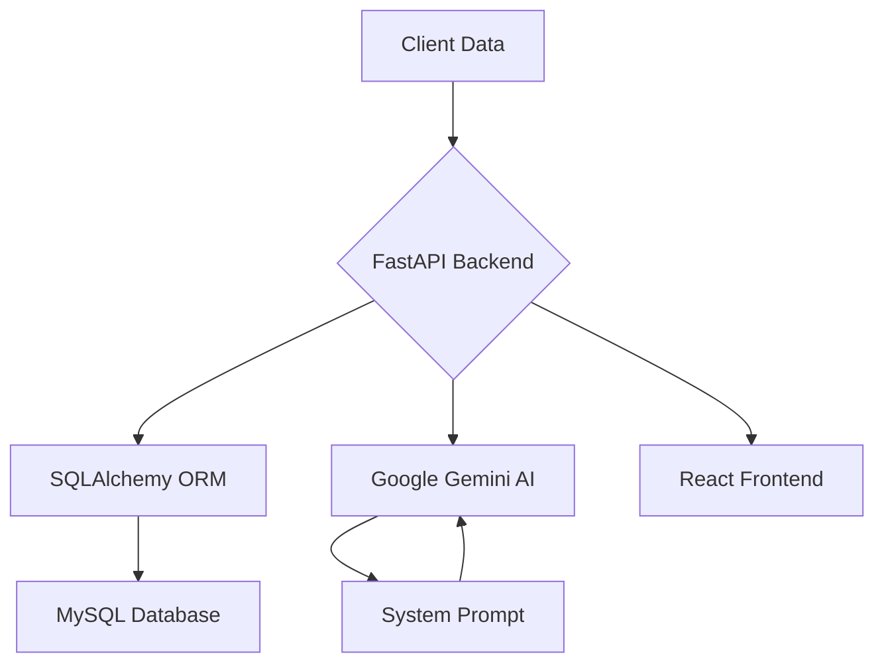

# WealthPilot: AI-Powered Wealth Management System

## Overview

An enterprise-grade solution combining AI analytics with financial expertise to deliver:

- Real-time client financial profiling
- Predictive wealth management recommendations
- Automated product matching engine
- Regulatory-compliant reporting
- Historical analysis tracking
- Multi-device responsive interface

## Features

-   **Client Analysis:** Fetches and displays AI-powered analysis for a given client ID.
-   **Client Table:** Displays a list of all clients from the database.
-   **Products Table:** Displays a list of all products from the database.
-   **Analysis History:** Shows a history of all client analyses performed.

## Tech Stack

-   **Frontend:** React, Vite
-   **Backend:** Python, FastAPI, SQLAlchemy, Google Gemini
-   **Database:** MySQL

## Project Structure

```
.
├── backend
│   ├── src
│   │   ├── database
│   │   ├── llm
│   │   └── router
│   └── requirements.txt
├── frontend
│   ├── src
│   │   ├── components
│   │   └── pages
│   └── package.json
└── README.md
```

## Installation & Setup

### Environment Configuration

1.  Navigate to the `backend` directory:
    ```bash
    cd backend
    ```
2.  Create a `.env` file from the template:
    ```bash
    cp dotenv.template .env
    ```
3.  Update the `.env` file with your database credentials and Gemini API key.

### Backend Setup

1.  Create a virtual environment:
    ```bash
    cd backend
    python -m venv venv
    ```
2.  Activate the virtual environment:
    ```bash
    venv\Scripts\activate
    ```
3.  Install the required dependencies:
    ```bash
    pip install -r requirements.txt
    ```
4.  Run the database migrations (SQLAlchemy will create the tables based on the models):
    ```bash
    # No migration command needed, SQLAlchemy creates tables on startup
    ```
5.  Start the development server:
    ```bash
    python -m src
    ```

### Frontend Setup

1.  Navigate to the `frontend` directory:
    ```bash
    cd frontend
    ```
2.  Install the required dependencies:
    ```bash
    npm install
    ```
3.  Start the development server:
    ```bash
    npm run dev
    ```

## API Reference

### Client Management

`GET /clients`

-   Returns a list of all clients.

### Product Catalog

`GET /products`

-   Returns a list of all products.

### AI Analysis

`GET /client_analysis/{client_id}`

-   Generates a personalized wealth management strategy for a given client.
-   **Path Parameters:**
    -   `client_id`: The ID of the client.
-   **Response Structure:**
    ```json
    {
      "client": { ... },
      "ai_analysis": {
        "client_summary": { ... },
        "recommendations": [ ... ]
      },
      "status": "success"
    }
    ```

`GET /client_analysis/history/all`

-   Returns the analysis history for all clients.

`GET /client_analysis/history/{client_id}`

-   Returns the analysis history for a specific client.

## AI Integration Architecture



**Key Components:**

1.  `gemini.py`: Handles the integration with the Google Gemini AI model, including rate limiting, response caching, and fallback mechanisms.
2.  `sysPrompt.py`: Maintains the system prompts for the AI model, ensuring regulatory compliance and accurate analysis.
