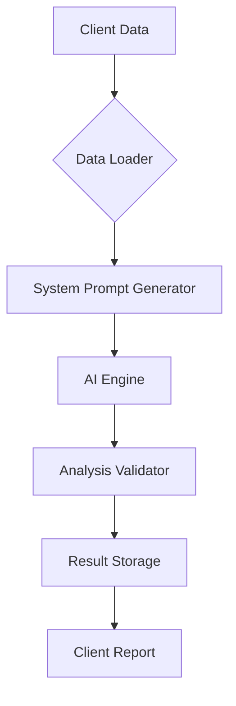

# WealthPilot: AI-Powered Wealth Management System

## Overview

An enterprise-grade solution combining AI analytics with financial expertise to deliver:

- Real-time client financial profiling
- Predictive wealth management recommendations
- Automated product matching engine
- Regulatory-compliant reporting
- Historical analysis tracking
- Multi-device responsive interface

## Tech Stack

- React
- Python FastAPI
- MySQL

## Installation & Setup

### Environment Configuration

```bash
cd backend
cp dotenv.template .env
```

### Frontend Setup

```bash
cd frontend
npm install
npm run dev
```

### Backend Setup

1. Create virtual environment:
```bash
cd backend
python -m venv venv
```

2. Activate and install dependencies:
```bash
venv\Scripts\activate
pip install -r requirements.txt
```

3. Start development server:
```bash
python -m src
```

## API Reference

### Client Management
`GET /clients`
- Returns paginated list of clients with filtering options
- Query Params:
  - `page` (default: 1)
  - `limit` (default: 20)
  - `sort` (field to sort by)

### Product Catalog
`GET /products`
- Returns HSBC's investment product catalog
- Supports search by product features:
  - `risk_level`
  - `minimum_investment`
  - `product_type` (e.g., 'ETF', 'Mutual Fund')

### AI Analysis
`GET /client_analysis/{client_id}`
- Generates personalized wealth management strategy
- Path Parameters:
  - `client_id`: UUID client identifier
- Response Structure:
  ```json
  {
    "risk_profile": "Conservative/Moderate/Aggressive",
    "recommended_products": [{
      "product_id": "HSBC-ETF-123",
      "allocation_percentage": 35,
      "rationale": "Matches client's long-term goals"
    }],
    "financial_health_score": 78,
    "timestamp": "2025-08-31T05:37:10Z"
  }
  ```


## Development

1. Start backend server:
```bash
cd backend
venv\Scripts\activate
python -m src
```

2. In separate terminal, start frontend:
```bash
cd frontend
npm run dev
```

## AI Integration Architecture


Key Components:
1. `gemini.py`: Handles AI model integration with:
  - Rate limiting
  - Response caching
  - Fallback mechanisms
2. `sysPrompt.py`: Maintains SEC-compliant templates for:
  - Risk disclosure
  - Product suitability checks
  - Regulatory requirements
